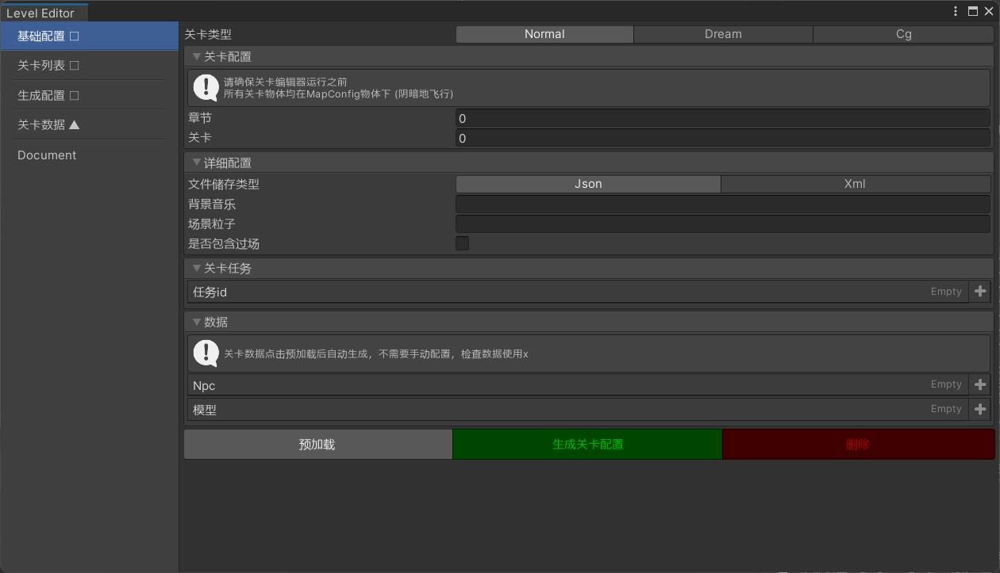

**关卡编辑器**

关卡编辑器能帮你快速去创建一个关卡，提高你的开发效率

**[如何使用关卡编辑器]**

- 打开Unity关卡编辑器场景Edit
- 找到场景下的MapConfig
- 将你的预制体放到该物体下，并旋转好位置
- 打开关卡编辑器 基础配置 列，配置好相应的章节与关卡  点击生成
- 关卡就这么简单的配置好了！
- 去喝杯热茶！

**[需要注意些什么]**

- 在编辑场景之前，先将MapConfig下的物体清理干净
- 相同关卡配置一遍后，再次配置将覆盖原本的配置
- 不要让热茶倒在键盘上！

**[关卡编辑器的架构相关]**

> 关卡编辑器是将MapConfig下的物体逐一遍历
>
> 在关卡最开始的设计中每一个Npc都有自己的Npc基类，该类包含了该物体所需的全部信息
>
> 对于解密游戏的关卡设计来说这极为重要
>
> 除此之外还需要搭配Npc编辑器以及任务编辑器
>
> 关卡的储存和读取其实可以简单看成一个类似于存档的功能（按照存档的思路去理解会很简单）
>
> 数据储存方式方面可选择了Json/xml

